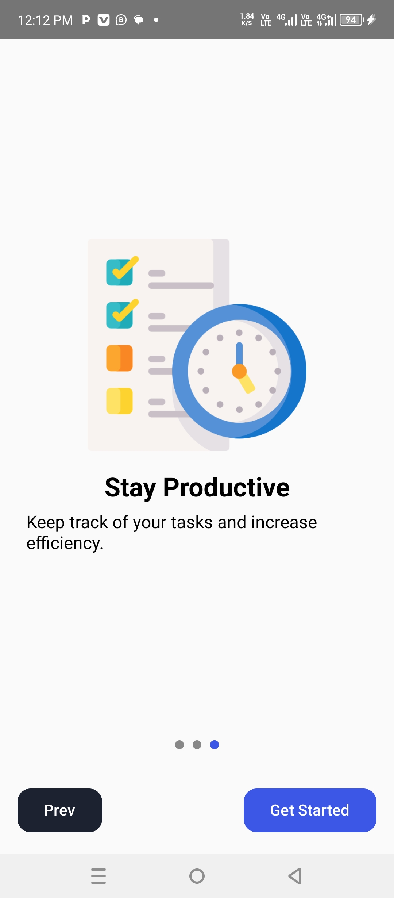

# How to Clone This Repository

To clone this repository, follow these steps:

1. Open your terminal or command prompt.
2. Run the following command:

   ```sh
   git clone https://github.com/Dismas-Ospaltic/Note-App-Hybrid.git
   

## About this app

This is an android-based app to manage notes, add, delete, update and so much.
The not is backed up in the clouds using PHP on the backend so you always access your data anywhere

## App's  screenshots
 

## Contributing

pull requests are welcome. for major Changes, please open an issue first to 
discuss what you would like to change.

Pleas make sure to update tests as appropriate